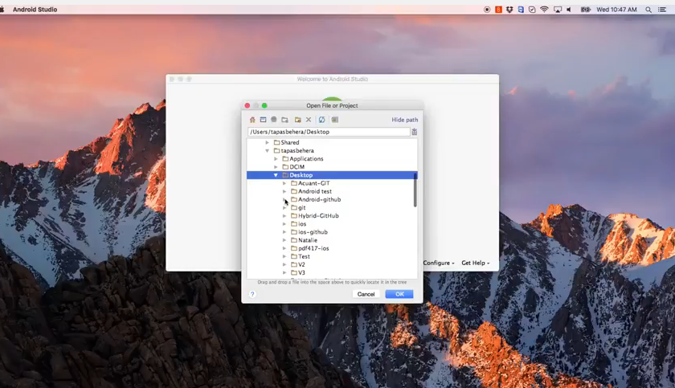

Acuant Android SDK Programmer's Guide
=====================================

**August 2019**

# Introduction

Acuant Web Services supports data extraction from driver’s licenses, state IDs, other government issued IDs, custom IDs, driver’s licenses, barcodes, passports, and medical insurance cards. It also supports document authentication and facial recognition to verify and authenticate the identity.

This document contains a detailed description of all functions that developers need to integrate with the Acuant Android Mobile SDK. The Acuant Android Mobile SDK requires a valid license key. Contact sales@acuantcorp.com to obtain a license key.

# Operating system and device requirements

The Acuant Android Mobile SDK API supports the following operating system version and devices:

**Operating System:**  Android SDK Version 17 or later

**Devices:**  5 MP camera resolution or higher

**Note** The card image must be taken in acceptable light conditions to avoid glare and overhead lights. The card should preferably be fitted within the brackets on the camera screen to allow the picture to be taken at maximum resolution.

# Preparing to install the Acuant Android Mobile SDK

This section describes how to add the Gradle framework to your project, including adding the **AcuantAndroidMobileSDK.aar** and JCenter dependencies.

#### Add the Gradle framework:
1. Add the **AcuantAndroidMobileSDK.aar** dependencies to add the framework to your project.
2. Add the following code to your **build.gradle** file:

		dependencies {
			configurations.create("default")
			artifacts.add("default", file('acuantMobileSDK.aar'))
		}
	
		android{
			packagingOptions {
			exclude 'META-INF/NOTICE'
			exclude 'META-INF/LICENSE'
			exclude 'META-INF/DEPENDENCIES'
			exclude 'META-INF/DEPENDENCIES.txt'
			exclude 'META-INF/LICENSE.txt'
			exclude 'META-INF/NOTICE.txt'
			}
		}
	
		dependencies {
			compile ('com.microblink:pdf417.mobi:6.4.0@aar')
			compile ('com.android.support:appcompat-v7:26+')
			compile ('com.google.code.gson:gson:2.8')
			compile ('com.squareup.okhttp3:okhttp:3.8.0')
			compile ('org.jmrtd:jmrtd:0.5.13')
			compile ('org.ejbca.cvc:cert-cvc:1.4.3')
			compile ('com.madgag.spongycastle:prov:1.54.0.0')
			compile ('net.sf.scuba:scuba-sc-android:0.0.9')
		}

3. Add the **AcuantAndroidMobileSDK** dependencies from **JCenter**:

		repositories {
			jcenter ()
			maven { url 'http://maven.microblink.com' }
		}

		dependencies {
			compile 'com.acuant.mobilesdk:acuantMobileSDK:5.2.2'
			compile ('com.microblink:pdf417.mobi:6.4.0@aar')
			compile ('com.android.support:appcompat-v7:26+')
			compile ('com.google.code.gson:gson:2.8')
			compile ('com.squareup.okhttp3:okhttp:3.8.0')
			compile ('org.jmrtd:jmrtd:0.5.13')
    		compile ('org.ejbca.cvc:cert-cvc:1.4.3')
    		compile ('com.madgag.spongycastle:prov:1.54.0.0')
    		compile ('net.sf.scuba:scuba-sc-android:0.0.9')
		}
	
4. Add the following code to your **build.gradle** file:
	
		android{
		 packagingOptions {
			 exclude 'META-INF/NOTICE'
			 exclude 'META-INF/LICENSE'
			 exclude 'META-INF/DEPENDENCIES'
			 exclude 'META-INF/DEPENDENCIES.txt'
			 exclude 'META-INF/LICENSE.txt'
			 exclude 'META-INF/NOTICE.txt'
		 }
		}
	  

5. If you are using **ProGuard** to obfuscate, add the following rules:

		-keep class com.microblink.** { *; }
		-keepclassmembers class com.microblink.** { *; }
		-dontwarn android.hardware.**
		-dontwarn android.support.v4.**
		-keep class cvlib.** { native <methods>; }

6. Add the followings activities to the **manifest.xml** file:

		<uses-permission android:name="android.permission.CAMERA" />
    	<uses-permission android:name="android.permission.ACCESS_NETWORK_STATE" />
    	<uses-permission android:name="android.permission.INTERNET" />
    	<uses-permission android:name="android.permission.FLASHLIGHT" />
		<uses-permission android:name="android.permission.NFC" />
		<uses-permission android:name="android.permission.ACCESS_FINE_LOCATION" />
    
		<activity android:name="com.acuant.mobilesdk.detect.CameraCardDetectManual"></activity>
		<activity android:name="com.acuant.mobilesdk.detect.PDF417.CameraPDF417"> </activity>
		<activity android:name="com.acuant.mobilesdk.detect.Camera2CardDetectManual"></activity>
		<activity android:name="com.acuant.mobilesdk.detect.Camera2FacialRecognitionManual" />
		
7. Add the following flag to <application> tag only if out of memory error is observed (optional)

		android:largeHeap="true"
		
	Refer : https://developer.android.com/guide/topics/manifest/application-element.html
		
7. Add the following flag to gradle.properties file (optional)

		// Some versions of Android studio may need this setting. This is required only 
		//when java.lang.UnsatisfiedLinkError is observed
		android.useDeprecatedNdk=true
	
	
## Using multiple APK support *(optional)*

Multiple APK support is a feature on Google Play that allows to split the large APK file into smaller APKs for different CPU architectures. This helps reduce the application size for the end user. See the instructions from Google to split the application as specified in https://developer.android.com/google/play/publishing/multiple-apks.html.

## Sample Applications
Acuant provides three sample applications.

**Note** You need a license key from Acuant to run these applications. Contact Acuant Technical Support to obtain a license key and the proper credentials.

- **Sample-App**			demonstrates AcuFill Data Capture and FRM
- **Sample-Connect-App**	demonstrates Connect Data Capture with AcuFill FRM

The following video demonstrates how to set up the license key or credentials for all projects.

Contact Acuant Technical Support if you need assistance. 

####Initialize and create the Android Mobile SDK instance:

Use the following call to pass an activity to initialize the **AcuantAndroidMobileSDKController** class, the cloud address, and the license key.

**Note** Do <em>not</em> include the **“https://”** as part of the cloud address. The correct form is:
**cloud.myAddress.com**.  Only set the cloud address if you are hosting Acuant Web Services in your own data center. By default, the Android MobileSDK communicates with the Acuant Data Center. 

  <pre><code>//Obtain the main controller instance
Instance = AcuantAndroidMobileSDKController.getInstance(activity, licenseKey);
</code></pre>

<strong>Note</strong> This method verifies if the license key is valid and it returns an instance that can be used to reference the methods. Acuant recommends that you <em>create one instance per session</em> in order to optimize your resources.

####Initialize the AcuantAndroidMobileSDKController class and license key: 

    AcuantAndroidMobileSDKController.getInstance(activity,licenseKey);`

####Initialize the AcuantAndroidMobileSDKController class with activity, cloud address, and license key:

    AcuantAndroidMobileSDKController.getInstance(activity,“cloud.myAddress.com”, licenseKey);`

#### Create the SDK instance with a valid license key:

Use the following call to validate the license key and create an SDK instance:
	
    public void validateLicenseKeyCompleted(LicenseDetails details){}`

After the license key is validated, the following callback will be called. The app should wait until this callback is called.

The following API can be used to check if a license key is already validated.

	public synchronized boolean isSDKValidated()

####Create the SDK instance with activity:

Pass an activity to initialize the **AcuantAndroidMobileSDKController** class, the entry point to the library:

    AcuantAndroidMobileSDKController.getInstance(activity);`

If your instance was created previously, you can obtain it using:

    AcuantAndroidMobileSDKController.getInstance();`

# Capturing and cropping a card

You need to know the card type that you want to capture to show the camera interface. Use the *manual* camera interface to capture a driver’s license, medical card, or passport. 

**Note** To capture a driver’s license, you must call two times (for the front and back sides of the card).

####Capture and crop a card:
1. Validate the license key and show the camera interface:

	    AcuantAndroidMobileSDKControllerInstance.getInstanceAndShowCameraInterface(contextActivity, license, activity,cardType, region, isBarcodeSide);

1. Show the manual camera interface methods:

	    AcuantAndroidMobileSDKControllerInstance.setWidth(myWidth);
	    acuantAndroidMobileSdkControllerInstance.
	    showManualCameraInterface(mainActivity,CardType.DRIVERS_LICENSE,
	    cardRegion, isBackSide);
	    
**Note** If CardType.AUTO is set, then **onCardCroppingFinish** the last parameter will contain the automatically detected card type. If a card type such as CardType.DRIVERS_LICENSE is set and a different card type such as **CardType.PASSPORT** is detected, then an **AcuantErrorIncorrectDocumentScanned** error occurs.

**Note** The width value is required and is set to indicate the width of the cropped card image.

After the user taps the screen, the image capture process begins. 

	public void onCardCroppedStart(Activity activity);
	
	
At the beginning of image capture event the following method will be called:

	void onCardImageCaptured();

There are four callback methods:

**activity**

The activity of the full screen window, or the activity owner of the modal dialog (for example, for Passport and Tablet).

	public void onCardCroppingFinish(Bitmap card_bitmap,int detectedCardType, HashMap<String,Object>imageMetrics); 

The **ImageMetrics** hashmap specifies the sharpness and glare threshold of a cropped image. An image with a sharpness grade of 0.3f or above is considered a sharp image. In general, a GLARE_GRADE of 1 means no glare and 0 means there is a high chance of having glare in the captured image. A glare grade 0.88f and above means there is no glare. Users may set the threshold based on their requirements.

The information can be retrieved as follows:  

		if(imageMetrics!=null && imageMetrics.get("IS_SHARP")!=null) { 
			boolean isSHarp = Boolean.parseBoolean(imageMetrics.get("IS_SHARP").toString()); 
			}
		if(imageMetrics!=null && imageMetrics.get("SHARPNESS_GRADE")!=null) 			
			float sharpnessGrade = Float.parseFloat(imageMetrics.get("SHARPNESS_GRADE").toString()); 
		    } 
		if(imageMetrics!=null && imageMetrics.get("HAS_GLARE")!=null) { 
			boolean hasGlare = Boolean.parseBoolean(imageMetrics.get("HAS_GLARE").toString()); 
			} 
		if(imageMetrics!=null && imageMetrics.get("GLARE_GRADE")!=null) 
			float glareGrade = Float.parseFloat(imageMetrics.get("GLARE_GRADE").toString()); 
    } 

**bitmap**

The image card result. This function returns the cropped card image:

	public void onCardCroppingFinish (Bitmap bitmapCropped, boolean scanBackSide, int detectedCardType, HashMap<String,Object>imageMetrics); `

**scanBackSide**

This function is called when the user taps the **Back** button. 

**Note** If **Back** is tapped in barcode interface and the barcode cropping on Cancel is enabled, then the arguments will contain the cropped image and the original image. Otherwise, the arguments will be Null.

**bitmap**

The image card result. This function returns the cropped card image:

	public void onOriginalCapture(Bitmap bitmap);

**bitmap**

The image before the cropping process begins. This function returns the card image *without* cropping.

	public void onCancelCapture(Bitmap croppedImageOnCancel, HashMap<String,Object>imageMetrics,Bitmap originalImageonCancel);

If the application is targeted for Android API level 23 and later, the control will return to the following method after the user taps Allow/Deny for camera permission. The **requestCode** will be **Permission. PERMISSION_CAMERA.** If the permission was previously granted manually, then the control won’t come here.

	//Override only for API level 23 and later

	@Override
	public void onRequestPermissionsResult(int requestCode,
										String permissions[], int[] grantResults) {
	 		switch (requestCode) {
		 		case Permission.PERMISSION_CAMERA: {
			 			// If request is cancelled, the result arrays are empty.
			 			if (grantResults.length > 0
					 		&& grantResults[0] == PackageManager.PERMISSION_GRANTED) {
				 		// Permission granted
			 		} else {
				 		// permission denied
					}
			 		return;
		 		}
	 		}
	}

#### Show the barcode camera methods:

	AcuantAndroidMobileSDKControllerInstance.setWidth(myWidth);

	AcuantAndroidMobileSDKControllerInstance.
	setPdf417BarcodeImageDrawable(getResources().
	getDrawable(R.drawable.barcode));

	acuantAndroidMobileSdkControllerInstance.
	showCameraInterfacePDF417(mainActivity, CardType.DRIVERS_LICENSE,
	cardRegion);

**Note** The width value is required and is set to indicate the width of the cropped card image.
A drawable can be provided before calling the **showCameraInterfacePDF417** method in order to be displayed in the barcode scanning functionality. If not, no image is shown.

After the user opens the camera, the detection process begins. There is only one callback method:

	public void onPDF417Finish(String result);

**result**

The barcode string result.

	public void onBarcodeTimeOut(Bitmap croppedImageOnTimeout, HashMap<String,Object>imageMetrics,Bitmap originalImageOnTimeout);

The **ImageMetrics** hashmap specifies the sharpness and glare threshold of a cropped image. An image with a sharpness grade of 0.3f or above is considered a sharp image. In general, a GLARE_GRADE of 1 means no glare and 0 means there is a high chance of having glare in the captured image. A glare grade 0.88f and above means there is no glare. Users may set the threshold based on their requirements.

The information can be retrieved as follows: 

		if(imageMetrics!=null && imageMetrics.get("IS_SHARP")!=null) { 
			boolean isSHarp = Boolean.parseBoolean(imageMetrics.get("IS_SHARP").toString()); 
			}
		if(imageMetrics!=null && imageMetrics.get("SHARPNESS_GRADE")!=null) 			
			float sharpnessGrade = Float.parseFloat(imageMetrics.get("SHARPNESS_GRADE").toString()); 
		    } 
		if(imageMetrics!=null && imageMetrics.get("HAS_GLARE")!=null) { 
			boolean hasGlare = Boolean.parseBoolean(imageMetrics.get("HAS_GLARE").toString()); 
			} 
		if(imageMetrics!=null && imageMetrics.get("GLARE_GRADE")!=null) 
			float glareGrade = Float.parseFloat(imageMetrics.get("GLARE_GRADE").toString()); 
    } 

This function will be triggered to alert that the capture is pending without closing the camera view. The argument croppedImage will have the cropped image of the last frame before this function is triggered. If the frame could not be cropped, then this argument will be Null.

	getBarcodeCameraContext();

**return**

The current barcode camera context. This function returns Null if the barcode camera is closed.

**pause**

This function pauses the barcode camera detection:

	pauseScanningBarcodeCamera();

**resume**

This function resumes the barcode camera detection:

	resumeScanningBarcodeCamera();

**return**

The current barcode camera context. This function resumes the barcode camera detection.

	finishScanningBarcodeCamera();

**return**

The current barcode camera context. This function closes the barcode camera.

	public void onCancelCapture();

Called when the user taps the **Back** button.

## Cleaning up the SDK controller

To avoid memory leaks, clean up the SDK controller when the Activity is destroyed. This will clean up any static reference to the Context Activity, Web Service Listener, and Card Cropping Listener. If a different Activity needs to listen to SDK callbacks while transitioning to a new Activity, then set the new Activity as the Listener. See the API documentation for more information.

			@Override
    		protected void onDestroy() {
        		super.onDestroy();
        		acuantAndroidMobileSdkControllerInstance.cleanup();
    		}
    		

## Customizing the interface  *(optional)*

You can add methods to customize the interface:

**setPdf417BarcodeImageDrawable**

Customize the barcode interface with an image (empty by default):
			
	AcuantAndroidMobileSDKControllerInstance.
		setPdf417BarcodeImageDrawable(
		getResources().getDrawable(R.drawable.barcode));

**setWatermarkText**

Method to see the watermark on your camera:

	AcuantAndroidMobileSDKController.setWatermarkText("Powered By Acuant",0,0,30,0);

**setInitialMessageDescriptor**

Customize the initial message (default is "Align and Tap" or “Tap to Focus”):

	setInitialMessageDescriptor(R.layout.hold_steady);

	setInitialMessageDescriptor(message, red, green, blue, alpha);

**setFinalMessageDescriptor**

Customize the capturing message (default is "hold steady"):

	setFinalMessageDescriptor(R.layout.align_and_tap);

	setFinalMessageDescriptor(message, red, green, blue, alpha);

**setFlashlight**

Enable or disable the flashlight (False by default):

	setFlashlight(showFlashlight);

	setFlashlight(left, top, right, bottom);

**setCropBarcode**

Enable or disable the barcode image cropping (False by default):

	setCropBarcode(canCropBarcode);
	
**setCaptureOriginalCapture**

Enables/disables capturing the original uncropped image:

	setCaptureOriginalCapture(false);
	
**setCropBarcodeOnCancel**

Enables/disables the barcode image cropping while tapping the Back button (False by default):

	setCropBarcodeOnCancel(true);

**setShowInitialMessage**

Enables/disables the action bar (False by default):

	setShowActionBar (false);

**setShowInitialMessage**

Enables/disables the status bar (False by default):

	setShowStatusBar (false);

**setShowInitialMessage**

Enables/disables the barcode camera message (False by default):

	setShowInitialMessage (false);

**setCanShowBracketsOnTablet**

Enables/disables the guiding brackets for tablets:

	setCanShowBracketsOnTablet(true);

## Specifying the card size 

Add the following methods to set the size of the card. If the proper card width is not set, the Mobile SDK will  be unable to process the card.

**For driver's license cards:**

	LicenseDetails details ;  // license details obtained during license key validation
	if(details.isAssureIDAllowed()){
		AcuantAndroidMobileSDKControllerInstance.setWidth(2024);
	}else {
		AcuantAndroidMobileSDKControllerInstance.setWidth(1250);
	}

**For medical insurance cards:**

	AcuantAndroidMobileSDKControllerInstance.setWidth(1500);

**For passport documents:**

	AcuantAndroidMobileSDKControllerInstance.setWidth(1478);

## Processing a card

After the capture and crop process, you can retrieve information by processing the cropped image.

#### Add a callback for the Web Service:

	AcuantAndroidMobileSDKControllerInstance.setWebServiceListener(callback);

#### Process the card image (driver's license cards):

	ProcessImageRequestOptions options = ProcessImageRequestOptions.getInstance();
	
		options.autoDetectState = true;
		options.stateID = -1;
		options.reformatImage = true;
		options.reformatImageColor = 0;
		options.DPI = 150;
		options.cropImage = false;
		options.faceDetec = true;
		options.signDetec = true;
		options.iRegion = region;
		options.acuantCardType = cardType;
		options.logTransaction = false;

	AcuantAndroidMobileSDKControllerInstance.callProcessImageServices(frontSideCardImage, backSideCardImage, barcodeString,callerActivity, options);

###Parameters

**region**

Integer parameter for the Region ID.
**Values:** United States – 0 | Australia – 4 | Asia – 5 | 
Canada – 1 | America – 2 | Europe – 3 | Africa – 7 | General Documents – 6

**autoDetectState**

Boolean value that indicates whether to auto detect the state of the ID.  **Values**: True | False (SDK won't auto detect the state of the ID and will use the value of ProcState integer)

**stateID**

Integer value of the state to which the ID belongs

- If **AutoDetectState** is True, then the SDK automatically detects the state of the ID and **stateID** value is ignored.
- If **AutoDetectState** is False, then the SDK uses the **stateID** integer value for processing. 

For a complete list of the different countries supported by the SDK and their different State integer values, see the ScanW document: <http://www.id-reader.com/ftp/applications/sdk/docs/ScanW.pdf>

**faceDetec**

Boolean value that indicates whether a face image is returned. True | False

**signDetec**

Boolean value that indicates whether a signature image is returned. True | False

**reformatImage**

Boolean value  that indicates whether a formatted image is returned. True | False (ignores value of **ReformatImageColor** and **ReformatImageDpi**)

**reformatImageColor**

Integer value that specifies the color value to reformat the image. Values: Image same color – 0 | Black and White – 1 | Gray scale 256 – 2 | Color 256 – 3 | True color – 4 | Enhanced Image – 5

**DPI**

Integer value that indicates the DPI value to reformat the image. Range is 150 - 600. The size of the image is dependent on the DPI value. Use a lower value (150 DPI) for a smaller image. 

**cropImage**

Boolean value that indicates whether to crop the RAW image. True | False Boolean value

**Note** The Mobile SDK crops the image; therefore, leave this flag set to **False**.

**logTransaction** 

Boolean value that indicates whether to save the transaction response on the Acuant cloud for future retrieval if logging is enabled on the license key. Values: True | False

**imageSettings**

The default value for **imageSettings** is -1. Do not adjust this value unless instructed by Acuant Technical Support.

#### Process the card image (medical insurance cards):

	ProcessImageRequestOptions options = ProcessImageRequestOptions.getInstance();

		options.reformatImage = true;
		options.reformatImageColor = 0;
		options.DPI = 150;
		options.cropImage = false;
		options.acuantCardType = cardType;

	AcuantAndroidMobileSDKControllerInstance.callProcessImageServices(frontSideCardImage, backSideCardImage, null, callerActivity, options);

###Parameters

**reformatImage**

Boolean value  that indicates whether a formatted image is returned. True | False (ignores value of **ReformatImageColor** and **ReformatImageDpi**)

**reformatImageColor**

Integer value that specifies the color value to reformat the image. **Values**: Image same color – 0 | Black and White – 1 | Gray scale 256 – 2 | Color 256 – 3 | True color – 4 | Enhanced Image – 5

**DPI**

Integer value that indicates the DPI value to reformat the image. Range is 150 - 600. The size of the image is dependent on the DPI value. Use a lower value (150 DPI) for a smaller image. 

**cropImage**

Boolean value that indicates whether to crop the RAW image. True | False Boolean value

**Note** The Mobile SDK crops the image; therefore, leave this flag set to **False**.

#### Process the card image (passport cards):

	ProcessImageRequestOptions options = ProcessImageRequestOptions.getInstance();

		options.reformatImage = true;
		options.reformatImageColor = 0;
		options.DPI = 150;
		options.cropImage = false;
		options.faceDetec = true;
		options.signDetec = true;
		options.acuantCardType = cardType;

	AcuantAndroidMobileSDKControllerInstance.callProcessImageServices(frontSideCardImage, null, null, callerActivity, options);

###Parameters

**faceDetec**

Boolean value that indicates whether to return a face image. True | False 

**signDetec**

Boolean value that indicates whether to return a signature image. True | False 

**reformatImage**

Boolean value  that indicates whether a formatted image is returned. True | False (ignores value of **ReformatImageColor** and **ReformatImageDpi**)

**reformatImageColor**

Integer value that specifies the color value to reformat the image. Values: Image same color – 0 | Black and White – 1 | Gray scale 256 – 2 | Color 256 – 3 | True color – 4 | Enhanced Image – 5

**DPI**

Integer value that indicates the DPI value to reformat the image. Range is 150 - 600. The size of the image is dependent on the DPI value. Use a lower value (150 DPI) for a smaller image. 

**cropImage**

Boolean value that indicates whether to crop the RAW image. True | False Boolean value

**Note** The Mobile SDK crops the image; therefore, leave this flag set to **False**.

## Post-processing card information

Use the **processImageServiceCompleted** callback method:

The **processImageServiceCompleted** method is called when Web Services completes. A ‘card’ with the card information is returned. It will be an instance of DRIVERS LICENSE, PASSPORT, or MEDICAL INSURANCE, according to the original card type you passed to Web Services.

	processImageServiceCompleted(AcuantCard card);
	
**card**

A ‘card ‘ object with the scanned information

**status**

One of the constants of **AcuantErrorType**

**message**

Error message from the server

You can retrieve properties such as state, signature, and name from this class. For example, these are some of the properties for a driver’s license card:

-  **String name;**

-  **String licenceID;**

-  **String address;**

-  **String city;**

-  **String zip;**

-  **String state;**

-  **String idCountry;**

-  **String eyeColor;**

-  **String hair;**

-  **String height;**

-  **String weight;**

-  **String licenceClass;**

-  **String restriction;**

-  **String sex;**

-  **String county;**

-  **String dateOfBirth;**

-  **String expirationDate;**

-  **String nameLast;**

-  **String nationality;**

-  **String placeOfBirth;**

-  **Bitmap faceImage;**

-  **Bitmap signImage;**

-  **Bitmap reformatImage;**

-  **String authenticationResult;**

-  **ArrayList<String> authenticationResultSummaryList**

###getName

You can retrieve the name by using:

	card.getName()

See the properties for all card types in the API documentation.

**Sample project implementation:**

	/**
		 *
		 */
	
	@Override
	
	public void processImageServiceCompleted(Card card) {
		if (Util.LOG_ENABLED) {
			Utils.appendLog(TAG, "public void processImageServiceCompleted(CSSNCard card, int status, String errorMessage)");
		}
		isProcessing = false;
		Util.dismissDialog(progressDialog);
		String dialogMessage = null;
		try {
			DataContext.getInstance().setCardType(mainActivityModel.getCurrentOptionType());
			if (card == null || card.isEmpty()) {
				dialogMessage = "No data found for this license card!";
			} else {
				switch (mainActivityModel.getCurrentOptionType()) {
					case CardType.DRIVERS_LICENSE:
						DataContext.getInstance().setProcessedLicenseCard((DriversLicenseCard) card);
						break;
					case CardType.MEDICAL_INSURANCE:
						DataContext.getInstance().setProcessedMedicalCard((MedicalCard) card);
						break;
					case CardType.PASSPORT:
						DataContext.getInstance().setProcessedPassportCard((PassportCard) card);
						break;
					default:
						throw new IllegalStateException("There is not implementation for processing the card type '" + mainActivityModel.getCurrentOptionType() + "'");
				}
				Util.unLockScreen(MainActivity.this);
				Intent showDataActivityIntent = new Intent(this, ShowDataActivity.class);
				this.startActivity(showDataActivityIntent);
			}	
	} catch (Exception e) {
		Utils.appendLog(TAG, e.getMessage());
		dialogMessage = "Sorry! Internal error has occurred, please contact us!";
	}
	if (dialogMessage != null) {
		Util.dismissDialog(alertDialog);
		alertDialog = Util.showDialog(this, dialogMessage,new DialogInterface.OnClickListener() {
		@Override
		public void onClick(DialogInterface dialog, int which) {
			isShowErrorAlertDialog = false;
		}});
		isShowErrorAlertDialog = true;
		}
	
	}
	
	
# Facial Recognition and Match

Acuant FRM (Facial Recognition Match) is a person authentication solution for mobile devices based on biometric facial recognition. Acuant FRM reduces fraud by matching the face biometrics to the face image on the driver’s license or passport. It performs real-time checks and processes the data within seconds. This secure solution is easy to integrate using the Acuant Android Mobile SDK.

Acuant FRM performs following checks to recognize a live face and match face biometrics to the face picture on the driver’s license or passport.

1. **Face position checks** ensure that the face is well detected, correctly centered, and at the appropriate distance from the camera.
2. **Distance-to-person algorithm** ensures that individual’s face is at optimal distance from the front camera. 
3. **Frontal face presentation** Ensures that individual is only presenting frontal face (Side faces are rejected).
4. **Eye blink tracking** checks for face liveliness to avoid spoofing attacks.
5. **Face biometrics capture** matches biometric data to the face image on a driver’s license or passport.

##  Acuant FRM APIs and classes

The **FacialRecognitionListener** gets a callback from the SDK interface. It includes the **onFacialRecognitionCompleted** and **onFacialRecognitionCanceled** interfaces:

####onFacialRecognitionCompleted

Called when a live face is successfully recognized. The **bitmap** parameter contains the face image recognized by facial recognition.
	
	public void onFacialRecognitionCompleted(final Bitmap bitmap);

####onFacialRecognitionCanceled

Called when the user cancels facial recognition.

	Public void onFacialRecognitionCanceled();

####showManualFacialCameraInterface

Shows the facial recognition interface: 

	AcuantAndroidMobileSDKController.getInstance().showManualFacialCameraInterface(Activity activity);

Use the following API to customize “Blink Slowly” instruction message:

	setInstructionText(String instructionStr, int left, int top,Paint paint)

###Parameters

**instructionStr**

Instruction to be displayed

**left**

Left padding

**top**

Top padding

**paint**

Paints object to specify color, text, or font

####processImageValidation

The facial match **processImageValidation** function call can be made the same way as the other card processing function calls, for example:
	
	public void processImageValidation(Bitmap faceImage,Bitmap idCropedFaceImage)
	{
		ProcessImageRequestOptions options = ProcessImageRequestOptions.getInstance();
		options.acuantCardType = CardType.FACIAL_RECOGNITION;
		acuantAndroidMobileSdkControllerInstance.callProcessImageServices(faceImage, idCropedFaceImage, null, this, options);
	}

####processImageServiceCompleted

The following Web Services callback method will be called after the above function call returns:

	@Override
		public void processImageServiceCompleted(Card card) {

		if(mainActivityModel.getCurrentOptionType()==CardType.FACIAL_RECOGNITION) {
			FacialData  processedFacialData = (FacialData) card;
		}
	}

If either a live face image or face image from ID card is not valid, then it won’t make any Web Services call. The call will return successfully with following values:

	facialData.facialMatch = false;
	facialData.faceLivelinessDetection = <Based on if live face detected or not>
	transactionId=null
	facialData.facialMatchConfidenceRating = null;

####setFacialRecognitionTimeoutInSeconds

Sets a timeout limit for facial liveliness detection (20 seconds by default):

	public synchronized void setFacialRecognitionTimeoutInSeconds(int seconds)
	

When it times out, the following callback method is called:

	public void onFacialRecognitionTimedOut(final Bitmap bitmap)
	
####showFacialTimeoutErrorDialog 

Specifies whether to show an alert or dismiss the facial interface immediately after a facial timeout

	public synchronized void showFacialTimeoutErrorDialog(boolean flag)
 
####getFacialMatch

The data class for facial results. Use the following methods to get the facial data:

	public boolean getFacialMatch() 
	public String getTransactionId() // Facial match transaction ID
	public Boolean getFacialEnabled() // If facial feature is enabled
	public Boolean getFaceLivelinessDetection() // If a live face was detected
	public String getFacialMatchConfidenceRating() // Confidence level out of 100

####getAuthenticationResult

 Use the **public String getAuthenticationResult()** and **public ArrayList<String> getAuthenticationResultSummaryList()** methods to see AssureID authentication results for driver's licenses and passports.

**getAuthenticationResult** can return one of the following values:

- Passed
- Failed
- Attention
- Unknown
- Skipped

**getAuthenticationResultSummaryList** returns the list of reasons when **AuthenticationResult** returns an *Attention* result.

**Note**:   **getAuthenticationResultSummaryList** will return empty list for **Passed**,**Failed**,**Unknown**, and **Skipped** results.

# Tracking Capture Device Location

If it is required to detect the location at which the ID/Passport is captured, location tracking can be enabled.

	//public void enableLocationAuthentication(Activity activity)
	acuantAndroidMobileSdkControllerInstance.enableLocationAuthentication(this);
	
Whenever location is required during the capture process, use the following methods to return location details:

	AcuantAndroidMobileSDKController instance = 
	AcuantAndroidMobileSDKController.getInstance();
	instance.getDeviceCountryName(); // Country of the device location
	instance.getDeviceCountryCode(); // Country code of the device location
	instance.getDeviceState(); // State of the device location
	instance.getDeviceCity(); // City of the device location
	instance.getDeviceArea(); //Area of the device location
	instance.getDeviceZipCode(); // zipcode of the device location
	instance.getDeviceAddress(); // Street address of device location
	
	
The following constants are included for location test result:

	public class LocationVerificationResult {
        public final static int PASSED = 1;
        public final static int FAILED = 0;
        public final static int NOT_AVAILABLE = 2;
	}
			
 The following location test fields are included in the **Card** class:

	public int idLocationStateTestResult;
	public int idLocationCountryTestResult;
	public int idLocationCityTestResult;
	public int idLocationZipcodeTestResult;
    		
    		
# Reading an e-Passport chip

If AssureID is enabled on your license key, then you can use the Acuant Android Mobile SDK to read the information on an e-Passport chip. 

####Scan and read an e-passport chip:

1. Specify the permission in the application manifest file:
		
		<uses-permission android:name="android.permission.NFC" />

1. Initialize the Android NFC Adapter:

		NfcAdapter nfcAdapter = NfcAdapter.getDefaultAdapter(this);
		
1. Ensure that the permission is provided in runtime for API level 23 and above. This can be modified as needed. For example:

		private void ensureSensorIsOn(){
        if(!this.nfcAdapter.isEnabled())
        {
            // Alert the user that NFC is off
            new AlertDialog.Builder(this)
                    .setTitle("NFC Sensor Turned Off")
                    .setMessage("In order to use this application, the NFC sensor must be turned on. Do you wish to turn it on?")
                    .setPositiveButton("Go to Settings", new DialogInterface.OnClickListener()
                    {
                        @Override
                        public void onClick(DialogInterface dialogInterface, int i)
                        {
                            // Send the user to the settings page and hope they turn it on
                            if (android.os.Build.VERSION.SDK_INT >= 16)
                            {
                                startActivity(new Intent(android.provider.Settings.ACTION_NFC_SETTINGS));
                            }
                            else
                            {
                                startActivity(new Intent(android.provider.Settings.ACTION_WIRELESS_SETTINGS));
                            }
                        }
                    })
                    .setNegativeButton("Do Nothing", new DialogInterface.OnClickListener()
                    {
                        @Override
                        public void onClick(DialogInterface dialogInterface, int i)
                        {
                            // Do nothing
                        }
                    })
                    .show();
        	}
        }

-	The following SDK API can be used to listen to NFC tags available in an e-Passport
		
		//public void listenNFC(Activity activity,NfcAdapter nfcAdapter)
		acuantAndroidMobileSdkControllerInstance.listenNFC(this,nfcAdapter);
		

1. If an NFC Tag is successfully discovered, then the control will return to the method of the Activity that was previously overridden:

		@Override
    	protected void onNewIntent(Intent intent)
    	{
        super.onNewIntent(intent);
       
       }
        

-	Set the Listener (inside the above method) to which the control will come after a chip is read successfully or an error occurs.

**AcuantTagReadingListener** 

The **AcuantTagReadingListener** is an interface with the following methods:

	public void tagReadSucceeded(final AcuantNFCCardDetails cardDetails, final Bitmap image, final Bitmap sign_image);
	public void tagReadFailed(final String message);
	
	
API to set callback listener.

		@Override
    	protected void onNewIntent(Intent intent)
    	{
        super.onNewIntent(intent);
        
        // Acuant SDK Instance
        AcuantAndroidMobileSDKController acuantAndroidMobileSdkControllerInstance =
        AcuantAndroidMobileSDKController.getInstance();
        
        
        if(acuantAndroidMobileSdkControllerInstance!=null){
    	// Setting listener
    acuantAndroidMobileSdkControllerInstance.setAcuantTagReadingListener(this);
            
        	}
        }
        
        
Finally the chip reading method to be called with three parameters (document number, date of birth and date of expiry) to read the information from the chip.

 	
	@Override
    	protected void onNewIntent(Intent intent)
    	{
        super.onNewIntent(intent);
        
        // Acuant SDK Instance
        AcuantAndroidMobileSDKController acuantAndroidMobileSdkControllerInstance =
        AcuantAndroidMobileSDKController.getInstance();
        
        
        if(acuantAndroidMobileSdkControllerInstance!=null){
            acuantAndroidMobileSdkControllerInstance.setAcuantTagReadingListener(this);
            String docNumber = passportCard.getPassportNumber();
            String dob = getFromattedStringFromDateString(passportCard.getDateOfBirth());
            String doe = getFromattedStringFromDateString(passportCard.getExpirationDate());
            acuantAndroidMobileSdkControllerInstance.readNFCTag(intent,docNumber,dob,doe);
        	}
        }

	

# Error handling
In order to handle the errors or alert over SDK’s action , you will receive the error on didFailWithError(int code, String message) method.

This is the implementation in the Sample project:

	@Override
	
	public void didFailWithError(int code, String message) {
	Util.dismissDialog(progressDialog);
	Util.unLockScreen(MainActivity.this);
	String msg = message;
	if (code == ErrorType.AcuantErrorCouldNotReachServer) {
	msg = getString(R.string.no_internet_message);
	}

	else if (code == ErrorType.AcuantErrorUnableToCrop){
	updateModelAndUIFromCroppedCard(originalImage);
	}
	
	alertDialog = Util.showDialog(this, msg, new DialogInterface.OnClickListener() {
	@Override
	public void onClick(DialogInterface dialog, int which) {
	isShowErrorAlertDialog = false;
	}
	});
	
	isShowErrorAlertDialog = true;
	if (Util.LOG_ENABLED) {
	Utils.appendLog(TAG, "didFailWithError:" + message);
	}
	
	// Message dialogs
	
	isValidating = false;
	isProcessing = false;
	isActivating = false;
	}

# Error Types

**AcuantErrorCouldNotReachServer = 0**

Could not reach server. Check the Internet connection.

	public final static int *AcuantErrorCouldNotReachServer* = 0; 
	
**AcuantErrorUnableToAuthenticate = 1**

The license key information is incorrect.

	public final static int *AcuantErrorUnableToAuthenticate* = 1;
	
**AcuantErrorUnableToProcess = 2**

The image received by the server was unreadable. Take a new one.

	public final static int *AcuantErrorUnableToProcess* = 2;
	
**AcuantErrorInternalServerError = 3**

Server error. Try again later.

	public final static int *AcuantErrorInternalServerError* = 3; 

**AcuantErrorUnknown = 4**
	
An unknown error occurred; unable to determine the reason. Try again later.

	public final static int *AcuantErrorUnknown* = 4; 
	
**AcuantErrorTimedOut = 5**

Request timed out, maybe because Internet connection is too slow.

	public final static int *AcuantErrorTimedOut* = 5;
	
**AcuantErrorAutoDetectState = 6**

An error occurred while trying to detect the state.

	public final static int *AcuantErrorAutoDetectState* = 6;
	
**AcuantErrorWebResponse = 7**

The json that was received by the server contained an error.

	public final static int *AcuantErrorWebResponse* = 7;
	
**AcuantErrorUnableToCrop = 8**

The received image can't be cropped.

	public final static int *AcuantErrorUnableToCrop* = 8;

**AcuantErrorInvalidLicenseKey = 9**

Invalid license key.

	public final static int *AcuantErrorInvalidLicenseKey* = 9;
	
**AcuantErrorInactiveLicenseKey = 10**

Inactive license key.

	public final static int *AcuantErrorInactiveLicenseKey* = 10;

**AcuantErrorAccountDisabled = 11**

Account is disabled.

	public final static int *AcuantErrorAccountDisabled* = 11;
	
**AcuantErrorOnActiveLicenseKey = 12**

Error on activation key.

	public final static int *AcuantErrorOnActiveLicenseKey* = 12;
	
**AcuantErrorValidatingLicensekey = 13**

Validation is still in progress.

	public final static int *AcuantErrorValidatingLicensekey* = 13;
	
**AcuantErrorIncorrectDocumentScanned = 16**

An incorrect document was scanned.

	public static final int AcuantErrorIncorrectDocumentScanned = 16;
	
**AcuantNoneError = 200**

Privacy settings are preventing access to the camera.

	public final static int *AcuantNoneError* = 200;

Copyright © 2003-2019 Acuant Inc. All rights reserved.

This document contains proprietary and confidential 
information and creative works owned by Acuant and its respective
licensors, if any. Any use, copying, publication, distribution, display,
modification, or transmission of such technology in whole or in part in
any form or by any means without the prior express written permission of
Acuant is strictly prohibited. Except where expressly provided by Acuant
in writing, possession of this information shall not be
construed to confer any license or rights under any Acuant intellectual
property rights, whether by estoppel, implication, or otherwise.

AssureID and *i-D*entify are trademarks of Acuant Inc. Other Acuant product or service names or logos referenced this document are either trademarks or registered trademarks of Acuant.

All 3M trademarks are trademarks of Gemalto Inc.

Windows ® is a registered trademark of Microsoft Corporation.

Certain product, service, or company designations for companies other
than Acuant may be mentioned in this document for identification
purposes only. Such designations are often claimed as trademarks or
service marks. In all instances where Acuant is aware of a claim, the
designation appears in initial capital or all capital letters. However,
you should contact the appropriate companies for more complete
information regarding such designations and their registration status.

**Acuant Inc.**

**6080 Center Drive, Suite 850**

**Los Angeles, CA 90045**
